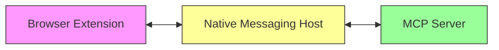

# Browser Extension Native Messaging Implementation

## Architecture Overview

The native messaging system consists of three main components:



### Component Roles

1. **Browser Extension** (`src/background/utils/mcp-connection.js`)
   - Establishes native messaging connection
   - Manages message sending/receiving
   - Handles request/response correlation
   - Implements browser actions

2. **Native Messaging Host** (System Level)
   - Bridges browser extension and MCP server
   - Handles message framing
   - Manages standard I/O streams

3. **MCP Server** (`mcpmonkey-server/src/index.ts`)
   - Implements MCP protocol
   - Validates messages using Zod
   - Processes browser requests
   - Returns structured responses

## Message Protocol

### 1. Message Types

#### Outgoing Messages (Extension → Server)
```typescript
interface BrowserMessage {
  type: 'executeAction';
  requestId: string;
  action: BrowserAction;
  data: unknown;
}

type BrowserAction = 'getTabs' | 'createTab' | 'closeTabs' | 'activateTab';
```

#### Incoming Messages (Server → Extension)
```typescript
// Success Response
interface BrowserActionResponse {
  type: 'browserActionResponse';
  requestId: string;
  action: string;
  data: unknown;
}

// Error Response
interface ErrorResponse {
  type: 'error';
  requestId: string;
  code: string;
  message: string;
}
```

### 2. Message Framing
- Length-prefixed (4-byte unsigned integer)
- JSON-encoded message body
- Newline-terminated for readability

```typescript
// Server-side message writing
const messageBuffer = Buffer.from(JSON.stringify(message) + '\n');
const lengthBuffer = Buffer.alloc(4);
lengthBuffer.writeUInt32LE(messageBuffer.length, 0);
process.stdout.write(lengthBuffer);
process.stdout.write(messageBuffer);
```

### 3. Message Validation
Server-side schema validation using Zod:
```typescript
const ResponseSchema = z.discriminatedUnion('type', [
  BrowserActionResponseSchema,
  ErrorResponseSchema,
]);
```

## Implementation Details

### 1. Connection Management

#### Extension Side
```javascript
const port = browser.runtime.connectNative('mcpmonkey');

port.onDisconnect.addListener((p) => {
  const error = browser.runtime.lastError;
  console.error('Disconnected from MCP server:', error?.message);
});
```

### 2. Request/Response Correlation

- Uses UUIDs for request tracking
- Maintains pending request map
- Implements request timeouts

```javascript
const pendingRequests = new Map();

async function sendBrowserMessage(action, data) {
  const requestId = crypto.randomUUID();
  return new Promise((resolve, reject) => {
    pendingRequests.set(requestId, { resolve, reject });
    // 30-second timeout
    setTimeout(() => {
      pendingRequests.delete(requestId);
      reject(new Error('Request timed out'));
    }, 30000);
  });
}
```

### 3. Browser Actions

Currently implemented actions:
- `getTabs`: Query browser tabs with filters
- `createTab`: Open new tabs
- `closeTabs`: Close specified tabs
- `activateTab`: Focus specific tabs
- `reloadTab`: Reload tabs
- `duplicateTab`: Duplicate tabs

Each action:
- Validates permissions
- Handles errors comprehensively
- Returns structured responses

### 4. Permission Management

```javascript
async function ensurePermissions(permissions, action, data) {
  const hasPermissions = await browser.permissions.contains({ permissions });
  if (!hasPermissions) {
    await mcpConnection.requestPermission(permissions.join(','), action, data);
    const granted = await browser.permissions.contains({ permissions });
    if (!granted) {
      throw new Error('Required permissions were not granted');
    }
  }
}
```

## Error Handling

### 1. Extension Side
- Connection errors
- Message validation failures
- Action execution errors
- Timeout handling

### 2. Server Side
- Message parsing errors
- Schema validation failures
- Action processing errors
- Response formatting errors

## Security Considerations

1. **Permission Management**
   - Explicit permission checks
   - User consent requirements
   - Granular access control

2. **Message Validation**
   - Strict schema validation
   - Type checking
   - Unknown message rejection

3. **Error Handling**
   - Comprehensive error types
   - Detailed error messages
   - Proper error propagation

## Current Status

### Implemented Features
✅ Basic message protocol
✅ Tab management actions
✅ Error handling
✅ Request/response correlation
✅ Message validation
✅ Permission checking

### Pending Implementation
🚧 Permission UI in extension
🚧 Reconnection logic
🚧 Advanced error types
🚧 Message compression
🚧 Batch operations
🚧 Protocol versioning

## Debugging Guide

### Common Issues
1. Connection failures
   - Check native messaging host configuration
   - Verify permissions in manifest
   - Check extension logs

2. Message validation errors
   - Verify message format
   - Check schema definitions
   - Monitor server logs

3. Permission issues
   - Review required permissions
   - Check permission granting flow
   - Verify user consent

### Debugging Tools
- Browser console for extension logs
- Server stdout/stderr for validation errors
- Message format verification
- Schema validation testing

## Next Steps

1. **Immediate**
   - Complete permission UI implementation
   - Add comprehensive error types
   - Implement reconnection logic

2. **Short Term**
   - Add remaining browser APIs
   - Implement batch operations
   - Add protocol versioning

3. **Medium Term**
   - Message compression
   - Performance optimization
   - Enhanced security measures

4. **Long Term**
   - Advanced debugging tools
   - Automated testing
   - Documentation improvements 